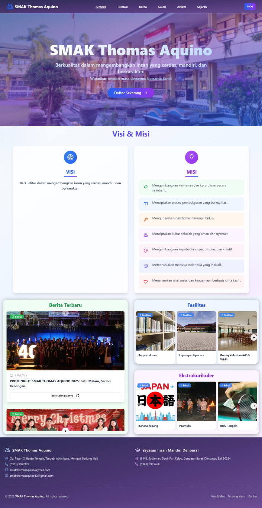
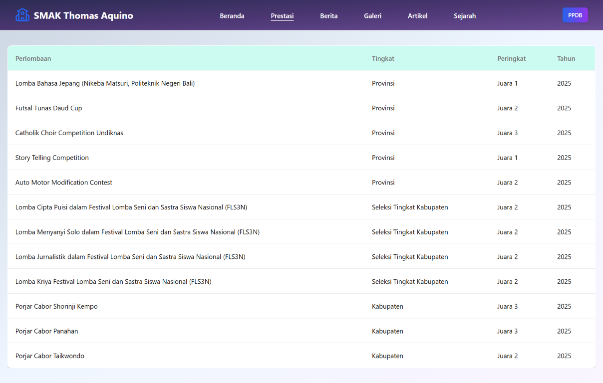
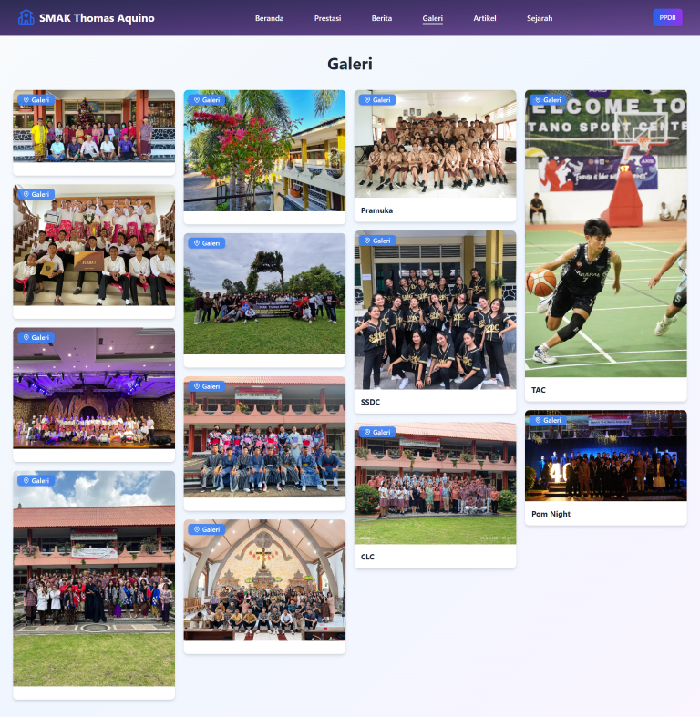
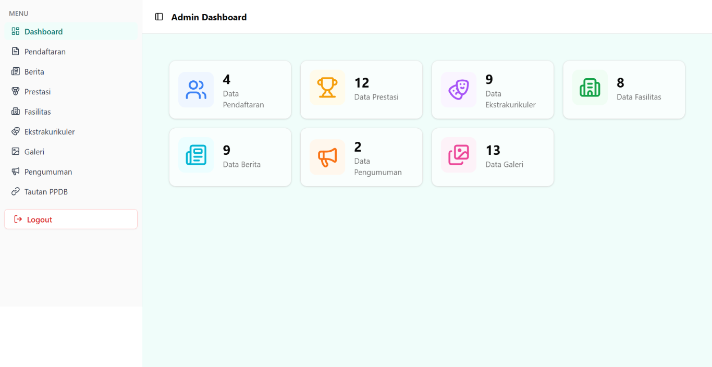

# School Management Platform

## Overview

This repository contains a fullstack school management platform built with Node.js (Express, MongoDB) for the backend (`server` folder) and Next.js (React) for the frontend (`client_next` folder). The platform supports features such as admin dashboard, school news, achievements, facilities, extracurriculars, gallery, announcements, registration, and more.

---

## Folder Structure

- **server/**

  - Node.js Express backend
  - MongoDB database
  - RESTful API endpoints for all school features
  - Authentication (admin)
  - Models, controllers, routes for each resource (prestasi, fasilitas, berita, dll)
  - Seeder script for initial data
  - File uploads (images, documents)

- **client_next/**
  - Next.js frontend (React)
  - Admin dashboard UI
  - Public site UI (school info, news, gallery, etc)
  - Authentication (admin login)
  - API integration with backend
  - Modern UI components (Tailwind, Lucide icons)

---

## Getting Started

### Prerequisites

- Node.js >= 18
- MongoDB (local or Atlas)

### Installation

1. Clone this repository:
   ```bash
   git clone <repo-url>
   cd TA2
   ```
2. Install dependencies for both backend and frontend:
   ```bash
   cd server && npm install
   cd ../client_next && npm install
   ```
3. Create `.env` in `server/` with:
   ```env
   DATABASE=mongodb://localhost:27017/ta2
   JWT_SECRET=your_jwt_secret
   ```
4. (Optional) Seed initial data:
   ```bash
   node server/seeder.js
   ```

### Running Development

- Start backend:
  ```bash
  cd server
  npm run dev
  ```
- Start frontend:
  ```bash
  cd client_next
  npm run dev
  ```
- Access frontend at [http://localhost:3000](http://localhost:3000)
- Backend API at [http://localhost:5000](http://localhost:5000)

---

## Features

- Admin authentication & dashboard
- CRUD for Prestasi, Fasilitas, Berita, Ekstrakurikuler, Galeri, Pengumuman, Tautan, Pendaftaran
- File/image upload (multer)
- Responsive UI (Tailwind CSS)
- Public site for school info
- API integration (axios)

---

## Deployment

- Docker support (see `docker-compose.yml`)
- Environment variables for production

---

## License

MIT

---

## Credits

- Built with Node.js, Express, MongoDB, Next.js, React, Tailwind CSS
- Icons by Lucide

## Screenshots

Home page:


Achievements page:


Gallery page:


News Page:


News detail page:


Admin Dashboard Page:

